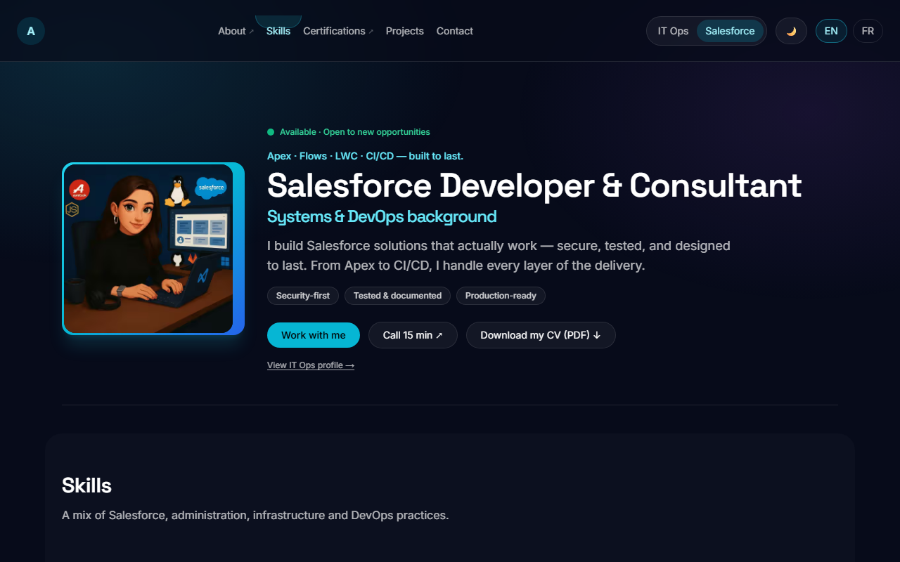
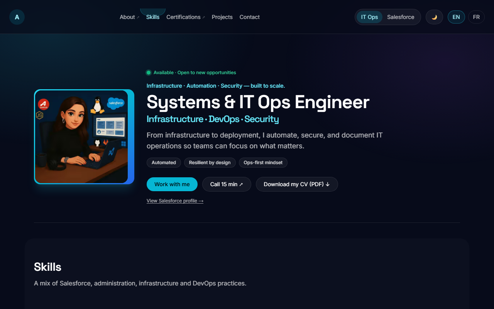
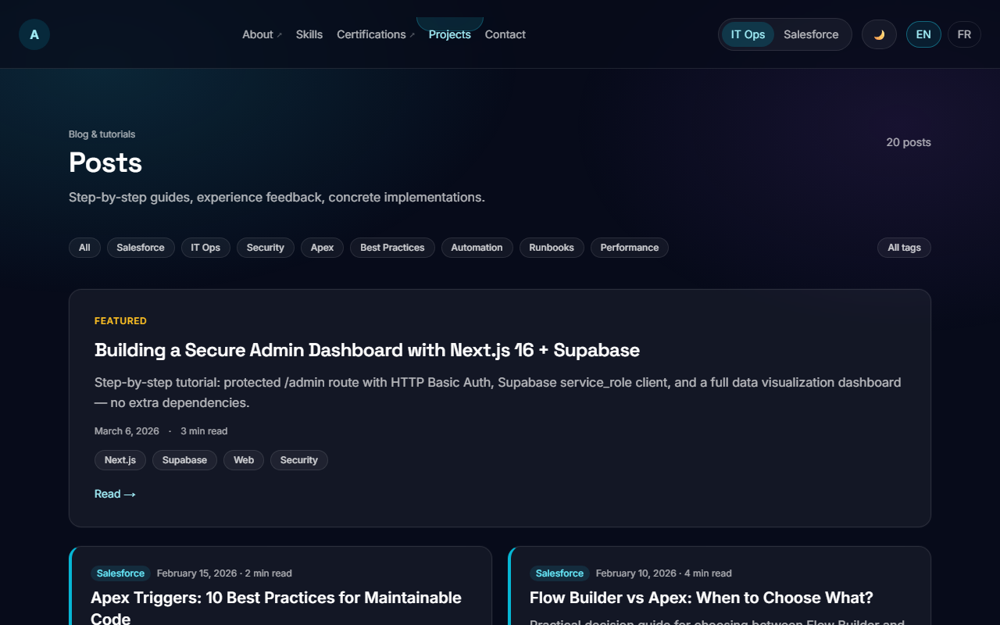
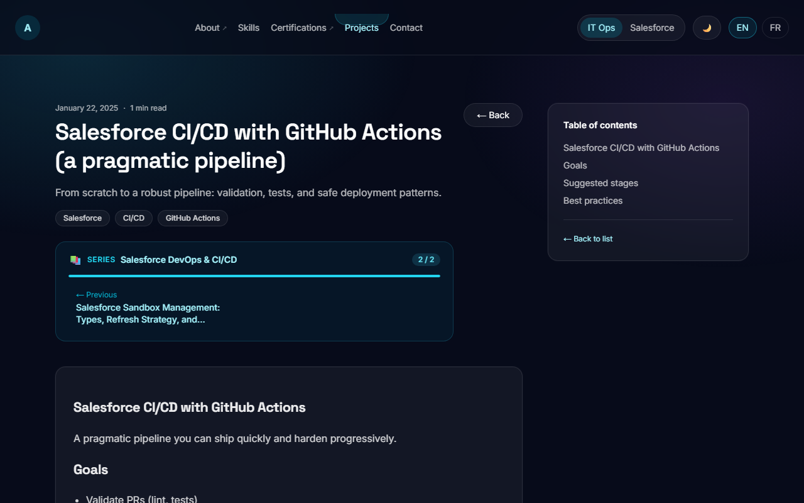
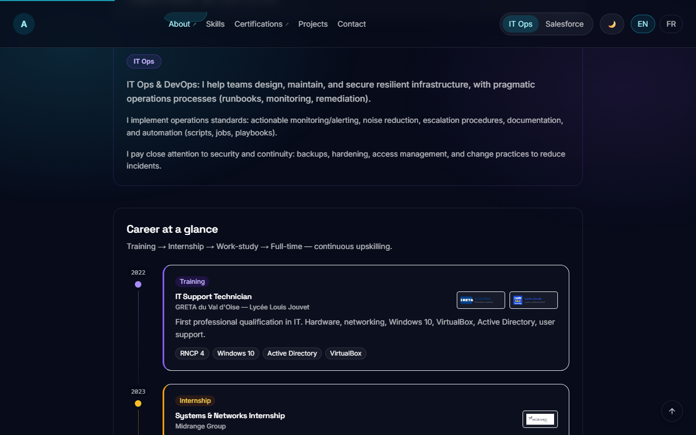
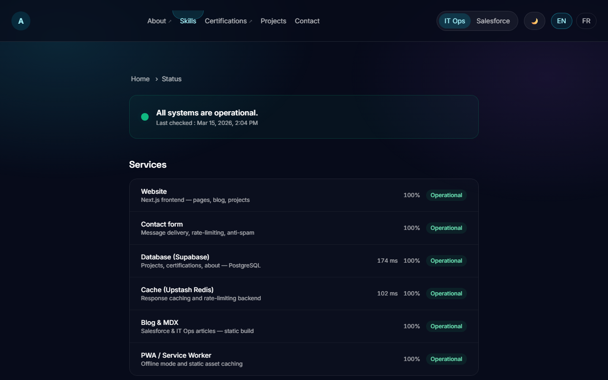

# Aïcha Imène DAHOUMANE — Portfolio

[](https://github.com/Aiyeesha/portfolio-next/actions/workflows/ci.yml)
[](https://portfolio-next-one-gold.vercel.app/en)
[](https://portfolio-next-one-gold.vercel.app/en)
[](LICENSE)

Professional portfolio of a **Salesforce Developer & Consultant** with a background in systems, networks, and DevOps.
Features a **track toggle** (Salesforce ↔ IT Ops) that dynamically adapts the hero, skills, services, and projects sections.

**Live → [portfolio-next-one-gold.vercel.app/en](https://portfolio-next-one-gold.vercel.app/en)**

---

## Screenshots

| Hero — Salesforce | Hero — IT Ops |
|---|---|
|  |  |

| Blog listing | Blog article |
|---|---|
|  |  |

| About — career timeline | Status — health checks & sparklines |
|---|---|
|  |  |

---

## Stack

| Layer | Technology |
|-------|-----------|
| Framework | Next.js 16 (App Router) + React 19 + TypeScript 5 |
| Styling | Tailwind CSS + next-themes (dark mode) |
| Animations | Framer Motion (scroll-triggered, parallax, stagger, reduced-motion aware) |
| i18n | next-intl (EN default / FR) |
| Backend | Supabase (PostgreSQL) — projects, about, certifications, contact, goals, uptime |
| Cache / Rate-limit | Upstash Redis (stale-while-revalidate + rate-limiting) |
| Blog | MDX (`@next/mdx`) + gray-matter + rehype/remark + article series |
| Forms | API Route + Formspree (fallback) + honeypot + rate-limit |
| Analytics | Vercel Analytics + Speed Insights (production only) |
| Monitoring | Vercel Cron (daily at 08:00 UTC) → `/api/cron/ping` → Supabase `uptime_pings` |
| Deployment | Vercel (Hobby) |

---

## Architecture

```
Browser
  │
  ├─ Next.js 16 (App Router — SSR + ISR)
  │     ├─ Server Components → Supabase REST API ──► PostgreSQL
  │     │                    → Upstash Redis (cache, rate-limit)
  │     ├─ Client Components → Framer Motion, next-intl, track toggle
  │     └─ API Routes
  │           ├─ /api/contact          → Formspree + Supabase messages
  │           ├─ /api/health           → ping Supabase + Redis + Formspree
  │           ├─ /api/cron/ping        → Vercel Cron (daily 08:00 UTC) → uptime_pings
  │           ├─ /api/errors           → client JS error reports (GlobalErrorHandler)
  │           └─ /api/testimonial-submit → testimonial_submissions
  │
  ├─ Supabase (PostgreSQL + RLS)
  │     Tables: projects · project_assets · about_pages · certifications
  │             messages · testimonials · testimonial_submissions
  │             goals_2026 · uptime_pings
  │
  ├─ Upstash Redis
  │     Keys: portfolio:rl:contact · portfolio:rl:testimonial
  │           portfolio:rl:newsletter · portfolio:rl:admin
  │           portfolio:rl:errors · portfolio:rl:revalidate
  │           portfolio:uptime:stats:30d · project:* · projects_with_assets:*
  │
  └─ Vercel
        CDN (static assets, ISR pages)
        Cron jobs (vercel.json)
        Analytics + Speed Insights
```

---

## Features

- **Dual-track hero** — Salesforce and IT Ops profiles share the same avatar; text, tags, and accent colors adapt per track
- **Availability modal** — pulsing "open to work" badge in the hero; click opens a modal detailing contract types, work modes, target roles, and location (FR/EN)
- **Dedicated pages** — `/about`, `/certifications`, `/blog`, `/projects`, `/status`, `/resources`, `/colophon`, `/changelog`, `/uses`
- **Career timeline** — visual timeline (2022 → present) on the About page
- **2026 Goals** — checkable objectives with `not_started / in_progress / completed` status (Supabase)
- **Blog** — 19 MDX articles (EN + FR), syntax highlighting, copy button, table of contents, reading time, article series, track-filtered homepage preview
- **Article series** — 6 curated reading paths (Salesforce DevOps, LWC, Windows Server, IT Ops Monitoring…)
- **Certifications page** — 3 sections: Completed, Active (Trailhead animated counters), In preparation
- **Testimonial form** — `/testimonial-submit?token=SECRET` — token-gated, stores to Supabase with `approved = false`
- **Contact form** — rate-limited, honeypot, topic selector, Calendly modal in hero + contact section
- **Status page** — real health checks (Supabase, Redis, Formspree), uptime % over 30 days, latency sparklines (7 days), ISR 60s
- **Admin dashboard** — `/admin` (HTTP Basic Auth) — project/cert/testimonial/message stats and recent contact messages
- **Command palette** — `⌘K` / `Ctrl+K` — navigate sections, switch track/theme/language, download CV, open LinkedIn
- **Animations** — Framer Motion: scroll parallax, directional reveals, stagger, AnimatedCounter, AnimatePresence on track switch
- **Open Graph** — dynamic OG images per blog article, project page, `/about`, and `/certifications` (`next/og`)
- **Security headers** — CSP, HSTS, X-Frame-Options, Referrer-Policy, Permissions-Policy, COOP, CORP; `X-Powered-By` suppressed
- **RSS feed** — `/feed.xml` (EN articles)
- **PWA** — Web App Manifest (installable), `display_override`, shortcuts, icons 192/512
- **Accessibility** — skip link, keyboard nav, focus rings, ARIA landmarks, WCAG 2.2 AA
- **SEO** — JSON-LD (WebSite + Person + ProfessionalService), sitemap, robots.txt, hreflang

---

## Getting started

### Prerequisites

- Node.js 24+
- npm (or pnpm / bun)

### Install & run

```bash
git clone https://github.com/Aiyeesha/portfolio-next.git
cd portfolio-next/portfolio
npm install
cp .env.example .env.local   # then fill in the required values
npm run dev
```

Open [http://localhost:3000/en](http://localhost:3000/en)

### Build

```bash
npm run build
npm start
```

---

## Environment variables

Copy `.env.example` to `.env.local` and fill in the values.
All `NEXT_PUBLIC_*` variables are exposed to the browser. Never put secrets in them.

| Variable | Required | Description |
|----------|----------|-------------|
| `NEXT_PUBLIC_SITE_URL` | ✅ | Canonical site URL (no trailing slash) |
| `NEXT_PUBLIC_SUPABASE_URL` | ✅ | Supabase project URL |
| `NEXT_PUBLIC_SUPABASE_ANON_KEY` | ✅ | Supabase anon key (public) |
| `SUPABASE_SERVICE_ROLE_KEY` | ✅ | Supabase service role key (server-only, never expose) |
| `UPSTASH_REDIS_REST_URL` | ✅ | Upstash Redis REST endpoint |
| `UPSTASH_REDIS_REST_TOKEN` | ✅ | Upstash Redis REST token (server-only) |
| `FORMSPREE_ENDPOINT` | Recommended | Formspree form endpoint URL |
| `NEXT_PUBLIC_CONTACT_EMAIL` | Recommended | Displayed contact email |
| `NEXT_PUBLIC_LINKEDIN_URL` | Recommended | LinkedIn profile URL |
| `NEXT_PUBLIC_CALENDLY_URL` | Optional | Calendly booking link |
| `NEXT_PUBLIC_CV_PDF_URL` | Optional | CV PDF URL (fallback: `/cv/cv-{locale}-{track}.pdf`) |
| `NEXT_PUBLIC_AVATAR_URL` | Optional | Avatar image URL (fallback: `/avatar.webp`) |
| `NEXT_PUBLIC_SAME_AS` | Optional | Comma-separated social profile URLs (JSON-LD sameAs) |
| `CACHE_INVALIDATE_SECRET` | Optional | Secret for `/api/cache/invalidate` endpoint |
| `CONTACT_RATE_LIMIT_WINDOW_SECONDS` | Optional | Rate-limit window in seconds (default: 600) |
| `CONTACT_RATE_LIMIT_MAX_REQUESTS` | Optional | Max requests per window (default: 5) |
| `TESTIMONIAL_SUBMIT_TOKEN` | Optional | Token for `/[locale]/testimonial-submit?token=...` (generate with `openssl rand -base64 32`) |
| `CRON_SECRET` | Optional | Bearer token Vercel sends to `/api/cron/ping` — set in Vercel Dashboard (generate with `openssl rand -base64 32`) |
| `ADMIN_USERNAME` | Optional | Username for `/admin` HTTP Basic Auth |
| `ADMIN_PASSWORD` | Optional | Password for `/admin` HTTP Basic Auth (generate with `openssl rand -base64 32`) |
| `BREVO_API_KEY` | Optional | Brevo (ex-Sendinblue) API key for newsletter subscriptions |
| `BREVO_LIST_ID` | Optional | Brevo contact list ID |
| `NEXT_PUBLIC_FORMSPREE_ID` | Optional | Formspree form ID (used by `/api/health` to check contact form availability) |

---

## Project structure

```
portfolio/
├── app/
│   ├── [locale]/               # Locale-scoped pages (App Router)
│   │   ├── page.tsx            # One-page landing (home)
│   │   ├── about/              # About page + opengraph-image.tsx
│   │   ├── certifications/     # Certifications & Diplomas + opengraph-image.tsx
│   │   ├── blog/               # Blog index + [slug] post pages + tags/
│   │   ├── projects/           # Projects [slug] detail pages + opengraph-image.tsx
│   │   ├── status/             # Public status page (health checks, uptime, sparklines)
│   │   ├── resources/          # Boîte à outils (20 tools, 4 categories)
│   │   ├── changelog/          # Public changelog page
│   │   ├── colophon/           # Full stack documentation
│   │   ├── uses/               # Tools & setup page
│   │   ├── legal/              # Legal notice
│   │   ├── privacy/            # Privacy policy
│   │   ├── accessibility/      # Accessibility statement
│   │   ├── testimonial-submit/ # Token-gated testimonial form
│   │   ├── error.tsx           # Locale error boundary (500 — useParams locale)
│   │   ├── not-found.tsx       # Locale 404 (useParams — no hydration flash)
│   │   └── layout.tsx          # Locale layout (Navbar, Footer, ScrollToTop)
│   ├── admin/                  # Admin dashboard (HTTP Basic Auth, Supabase service_role)
│   ├── api/                    # API routes
│   │   ├── contact/            # Contact form → Supabase + Formspree
│   │   ├── cache/invalidate/   # Manual Redis cache invalidation
│   │   ├── cron/ping/          # Vercel Cron (daily 08:00 UTC) → uptime_pings
│   │   ├── errors/             # Client JS error reports (GlobalErrorHandler → sendBeacon)
│   │   ├── health/             # Ping Supabase + Redis + Formspree
│   │   ├── blog/latest/        # Latest posts API
│   │   ├── testimonial-submit/ # Token-gated testimonial submission
│   │   ├── newsletter/         # Newsletter opt-in
│   │   └── github-activity/    # GitHub contribution data
│   ├── error.tsx               # Root error boundary (500)
│   ├── feed.xml/               # RSS feed route handler
│   ├── layout.tsx              # Root HTML layout (JSON-LD, fonts, analytics, GlobalErrorHandler)
│   ├── opengraph-image.tsx     # Default OG image (1200×630)
│   ├── twitter-image.tsx       # Twitter card image
│   ├── sitemap.ts              # Dynamic sitemap
│   ├── robots.ts               # robots.txt
│   └── manifest.ts             # PWA manifest
├── components/                 # 47 reusable React components (Server + Client)
├── content/
│   ├── blog/
│   │   ├── posts/{en,fr}/      # 19 MDX articles × 2 locales
│   │   ├── registry.ts         # Article metadata registry
│   │   ├── series.ts           # Article series definitions
│   │   └── toc.ts              # Table of contents utilities
│   ├── about.ts                # Static about content (FR + EN)
│   ├── certifications.ts       # Static certifications data
│   ├── experience.tsx          # Work experience accordion data
│   ├── testimonials.ts         # Testimonials (feature-flagged)
│   └── skills.ts / services.ts
├── lib/
│   ├── data/                   # Supabase data fetchers (cached via Redis)
│   ├── supabase/               # Supabase client helpers (anon + service_role)
│   └── ratelimit.ts / redis.ts / cache.ts / analytics.ts
├── messages/
│   ├── en.json                 # English translations (~400 keys)
│   └── fr.json                 # French translations (~400 keys)
├── supabase/                   # SQL migration files
├── scripts/                    # Utility scripts (db:migrate, CV generation)
└── public/
    ├── .well-known/
    │   └── security.txt        # RFC 9116 security contact
    ├── companies/              # Trusted-by company logos (webp)
    ├── projects/               # Project screenshots and source files
    └── cv/                     # CV PDFs (per locale/track)
```

---

## Deployment (Vercel)

1. Import the repository in [Vercel](https://vercel.com)
2. Set **Root Directory** to `portfolio`
3. Configure all required environment variables
4. Deploy — Vercel handles build, CDN, and HTTPS automatically

---

## Scripts

```bash
npm run dev          # Development server
npm run build        # Production build
npm run start        # Start production server
npm run lint         # ESLint
npm run typecheck    # TypeScript check (tsc --noEmit)
npm test             # Jest unit tests
```

---

## Security

| Layer | Measure |
|-------|---------|
| HTTP headers | CSP, HSTS (2 yr + preload), X-Frame-Options, Referrer-Policy, Permissions-Policy, COOP, CORP — `X-Powered-By` suppressed |
| Database | Supabase RLS on all tables — `project_assets` restricted to published projects only |
| Rate-limiting | Upstash Redis sliding window on `/api/contact`, `/api/newsletter`, `/api/testimonial-submit`, `/api/cache/invalidate`, `/api/revalidate`, `/api/health`, `/api/errors`, and `/admin` (brute-force protection) |
| Admin panel | HTTP Basic Auth + middleware rate-limit (10 req / 5 min / IP) |
| Contact form | Honeypot, origin check, server-side input validation, dual submission |
| Debug routes | `/api/redis-test` returns 404 in production |
| Crawlers | `robots.txt` disallows `/cv/` and `/admin/` |

See [`SECURITY.md`](SECURITY.md) for the full security policy and vulnerability disclosure process.
Security contact: [`/.well-known/security.txt`](public/.well-known/security.txt)

---

## License

MIT — see [LICENSE](LICENSE).
Content (texts, CV, photos) © Aïcha Imène DAHOUMANE — all rights reserved.
